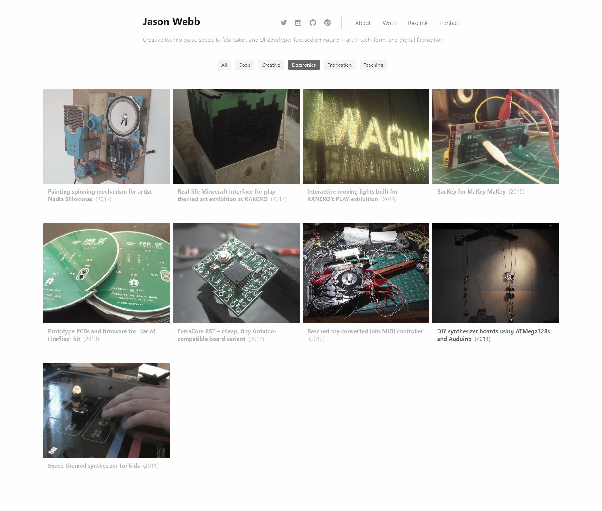
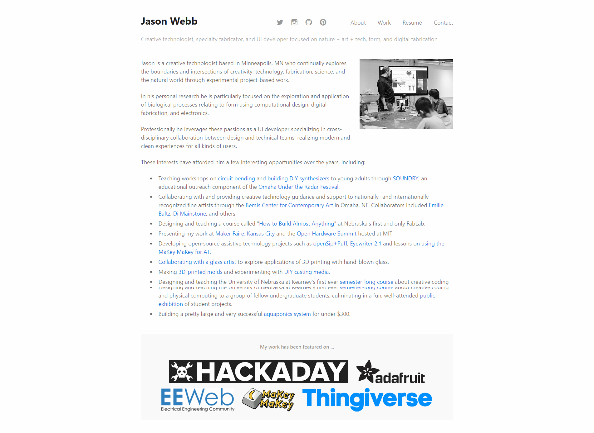
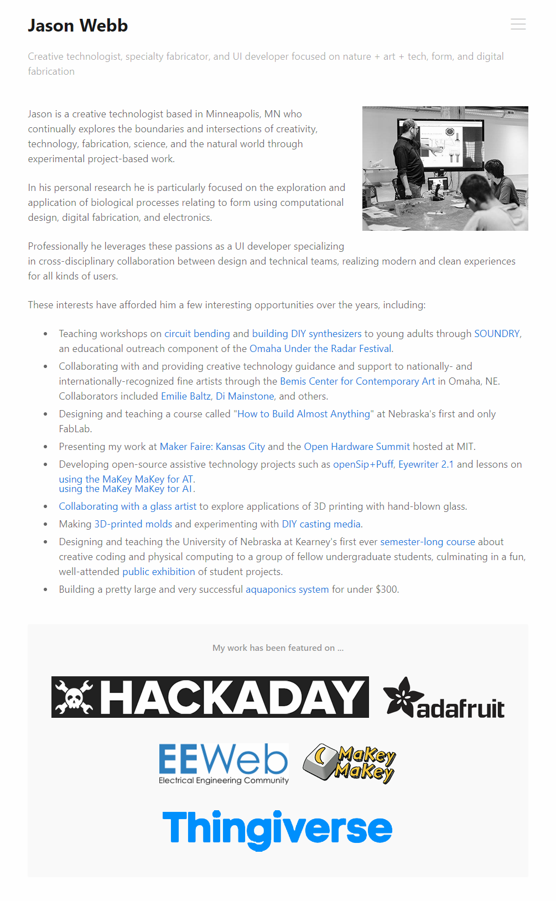
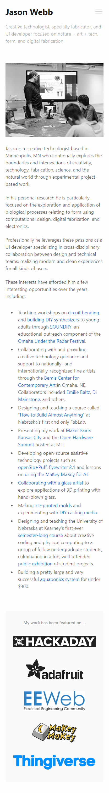

## Packages and frameworks used

* [Bulma](https://bulma.io/) for its built-in mini-reset, clean typography, and various base styles for components like form fields and alerts
* [Gulp](https://gulpjs.com/) for the build system, written in ES6 syntax
* [Babel](https://babeljs.io/) to enable ES6 syntax
* [Browserify](http://browserify.org/) to enable Node-style `require()`s

## WordPress plugins used

* [BJ Lazy Load](https://wordpress.org/plugins/bj-lazy-load/)
* [Classic Editor](https://wordpress.org/plugins/classic-editor/)
* [Contact Form 7](https://wordpress.org/plugins/contact-form-7/)
* [WP Super Cache](https://wordpress.org/plugins/wp-super-cache/)
* [Yoast SEO](https://wordpress.org/plugins/wordpress-seo/)

## Screenshots

